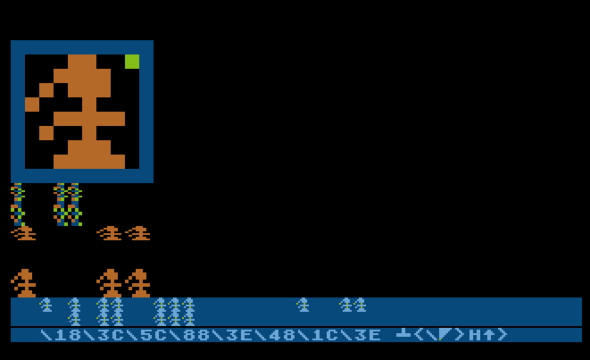

# 2019-MiniCharacterEditor
Mini Character Editor utility in Turbo BASIC XL for Atari 8-bit. Entry for 2019 10-line BASIC contest

One of the great features of the Atari computers was the ability to redefine the character set. Normally, the character set — the collection of letters, numbers, punctuation, and special symbols that the computer can display — is pulled from ROM, where it can’t be changed. But the Atari had the ability to look elsewhere in memory for the character set. Using that feature, you could create customized characters, put them in RAM, then tell the computer to use your custom character set. With that, you might change the standard letter A into a fancy script A, or into a little spaceship.

Back in the day most of us used Atari BASIC, and you could tell when a game was going to use a custom character set: PLEASE WAIT. When that message appeared, it would mean a delay of 30 to 40 seconds while the program copied the character set from ROM to RAM. Actually installing custom characters was very fast; the slow-verhead was in BASIC copying the whole set around memory. If a programmer was sophisticated enough to write a machine language subroutine, the same job could be done in a fraction of a second. I certainly wasn’t, and apparently neither were most of the programmers who had type-in games published in Compute!, Antic, and other computer magazines.

Happily, TurboBASIC XL has a memory move command, which does same work with the speed of machine language, removing the interminable wait to copy characters around.

Here’s how I set up a custom character set in another program I wrote, Poke Pig:

CH=(PEEK(106)-16)*256:’Define a chunk of RAM under the “top” of BASIC’s memory space. This is enough space to hold the character set. The memory location of the start of that space is put into variable CH.

MOVE 57344,CH,1024:’Copy the character set from its location in ROM (it starts at 57344 and is 1024 bytes) to the space we set aside in RAM. This is the part that used to take 30-40 seconds.

DIM F$(8):’This program only defines one special character, which will replace the # character. We’ll put the data for this character in F$. We need 8 bytes for that character data. Changing two characters would take 16 bytes, and so on.

F$=“\E7\DB\81\42\99\99\42\3C”:‘Here’s the data for the new # character. Here it’s a bunch of hex numbers. In the listing that will be represented by a mess of eight ATASCII characters. The Mini Character Editor program generates these hex numbers (and the ATASCII version) based on your drawing.

MOVE ADR(F$),CH+24,8:’Copy the custom character, in F$, which is 8 bytes, replacing the # character, which is located at CH+24.

POKE 756,CH/256:’Tell the computer to start using our copy of the character set instead of the official ROM version.

So, that mess of hex codes in F$. Each hex number represents one row in the eight lines of a character. Normally I would draw the 8x8 character on graph paper, then convert each row to its binary number, then convert that number to its hex or ATASCII equivalent.

The Mini Character Editor program lets you draw a character using the joystick, see it instantly in the Atari’s five graphics modes (BASIC modes 0,1, 2, 4 and 5), and see the hex code and ATASCII string so you can install that graphic in your own program.

In addition to drawing with the joystick, there are four keyboard commands for manipulating the graphic: H for horizontal flip, V for vertical flip, D to move everything down one line, R to move everything right one space.

When you’re ready to install the graphic in your own program, copy down the hex numbers by hand (there are only 8 of them!) or BREAK out the program and type_ ?A$_ to get the ATASCII version to export into your program. 

Mini Character Editor fits in ten 120-character lines. Because it is not a game, i qualifies for the WILD category of the 10-line BASIC contest. I think it’s my first program to use a custom display list, which I (re?)learned about from the book ]The Creative Atari.](https://www.atariarchives.org/creativeatari/Modifying_Display_Memory.php)
